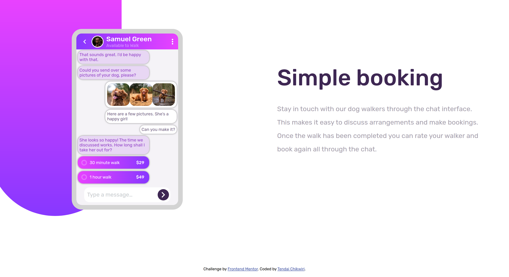
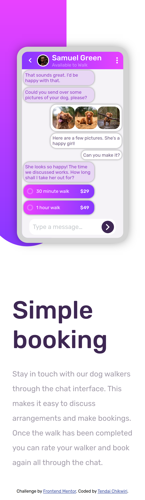

# Frontend Mentor - Chat app CSS illustration solution

This is a solution to the [Chat app CSS illustration challenge on Frontend Mentor](https://www.frontendmentor.io/challenges/chat-app-css-illustration-O5auMkFqY). Frontend Mentor challenges help you improve your coding skills by building realistic projects. 

## Table of contents

- [Overview](#overview)
  - [The challenge](#the-challenge)
  - [Screenshot](#screenshot)
  - [Links](#links)
- [My process](#my-process)
  - [Built with](#built-with)
- [Author](#author)

## Overview

### The challenge

Users should be able to:

- View the optimal layout for the component depending on their device's screen size
- **Bonus**: See the chat interface animate on the initial load

### Screenshot

### Links
- <a href="https://github.com/TendaiChikwiri/chat-app-illustration" target="_blank">Solution: GitHub</a>
- <a href="https://github.com/TendaiChikwiri/chat-app-illustration" target="_blank">Live Site</a>

## My process

### Built with

- HTML 
- CSS

## Author

- Website - [Tendai Chikwiri](https://github.com/TendaiChikwiri)
- Frontend Mentor - [@TendaiChikwiri](https://www.frontendmentor.io/profile/TendaiChikwiri)

